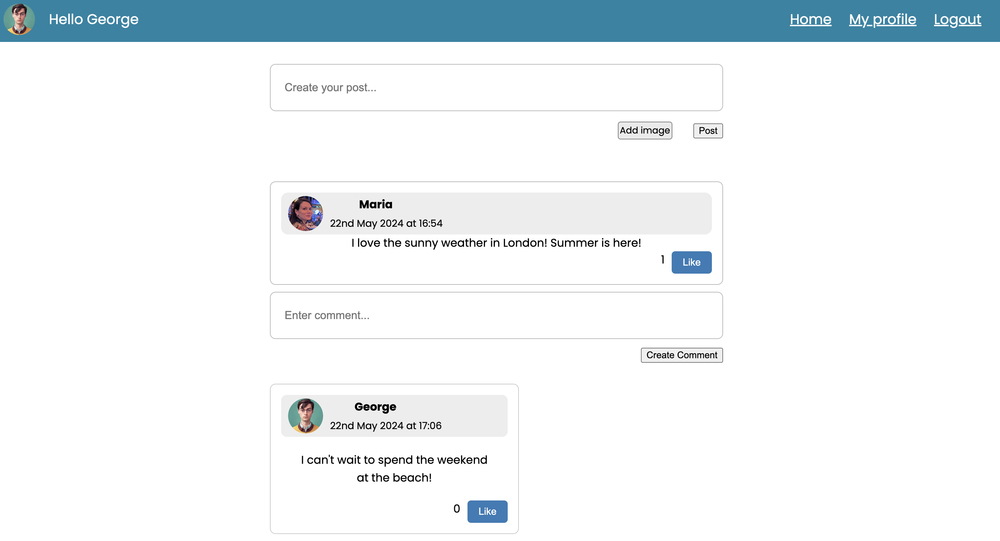
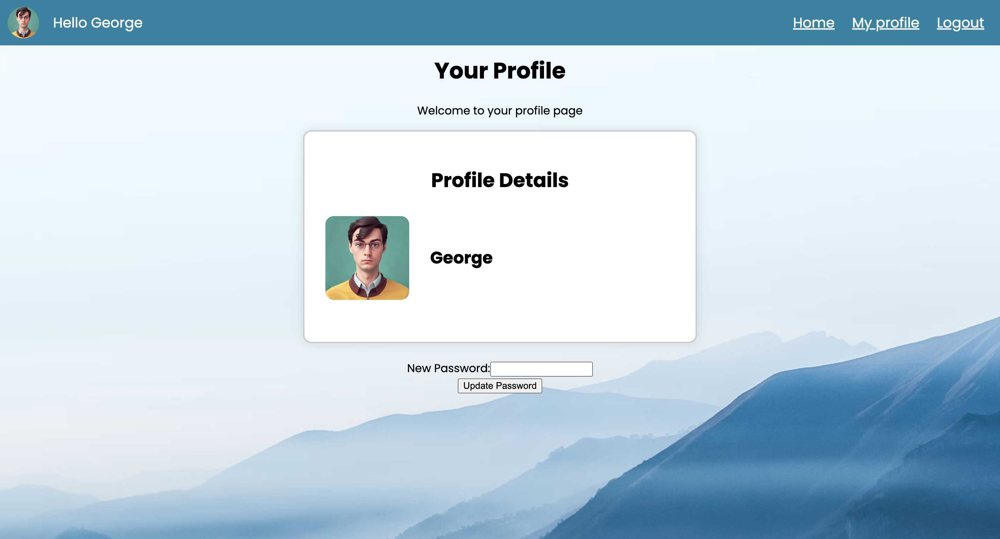

# Acebook MERN project

## STRUCTURE

This repo contains two applications:

- A frontend React App
- A backend api server

These two applications will communicate through HTTP requests, and need to be
run separately.

## DOCUMENTATION

[More documentation of the codebase and its architecture can be found here.](./DOCUMENTATION.md)

## SETUP

### Install nvm

`curl -o- https://raw.githubusercontent.com/nvm-sh/nvm/v0.39.1/install.sh | bash`

### Reload your ~/.zshrc file

`source ~/.zshrc`

### Install Node.js 
Install the latest version of [Node.js](https://nodejs.org/en/), (`20.5.0` at
time of writing).

### Install Node using nvm

`nvm install node`
`nvm use node`

### Install dependencies for both the frontend and api applications:
   ```
   cd frontend
   npm install
   cd ../api
   npm install
   ```

### Install an ESLint plugin for your editor, for example
   [ESLint for VSCode](https://marketplace.visualstudio.com/items?itemName=dbaeumer.vscode-eslint)

### Install MongoDB
   ```
   brew tap mongodb/brew
   brew install mongodb-community@6.0
   ```
   _Note:_ If you see a message that says
   `If you need to have mongodb-community@6.0 first in your PATH, run:`, follow
   the instruction. Restart your terminal after this.

### Start MongoDB

   ```
   brew services start mongodb-community@6.0
   ```

### Setting up environment variables.

We need to create two `.env` files, one in the frontend and one in the api.

#### Frontend

Create a file `frontend/.env` with the following contents:

```
VITE_BACKEND_URL="http://localhost:3000"
```

#### Backend

Create a file `api/.env` with the following contents:

```
MONGODB_URL="mongodb://0.0.0.0/acebook"
NODE_ENV="development"
JWT_SECRET="secret"
```

### How to run the server and use the app

1. Start the server application (in the `api` directory) in dev mode:

```
; cd api
; npm run dev
```

2. Start the front end application (in the `frontend` directory)

In a new terminal session...

```
; cd frontend
; npm run dev
```

You should now be able to open your browser and go to
`http://localhost:5174/signup` to create a new user.

Then, after signing up, you should be able to log in by going to
`http://localhost:5174/login`.


# WEB APP DESCRIPTION

## Acebook | Facebook-like web app | April 2024 | 2-week project
** Tech MERN stack |  MongoDB  |  Express | React | Node.js **
** Group project **

A social media web app inspired by the Facebook app. The team was required to navigate a complex legacy codebase using the MERN stack and extend the existing functionalities of signup, login with authentication, and viewing existing posts. Notably, our team had no prior experience with the MERN stack, so we had to learn and adapt to this technology in a very limited time.

In addition to the existing features, we successfully implemented several key functionalities including creating a new post, liking and commenting a post, posting and commenting using images, viewing profile details and editing account password.

A significant part of our project involved working with the NoSQL database MongoDB, which we had no prior experience utilising. Therefore, we had to overcome the challenge of understanding the differences in data storage and management—such as the concepts of schemas and collections. Using MongoDB provided benefits, such as flexible schema design that is easier to adapt if the project requirements change later on, and seamless integration with the other components of the MERN stack.

Express.js and Node.js allowed us to handle routing, authentication, and facilitate communication between the frontend and backend seamlessly. This streamlined our development process and helped us maintain a clean, modular codebase.

React was instrumental in building our dynamic and responsive user interface. It allowed us to create reusable UI components, manage state efficiently, and update the view in response to data changes without reloading the page. 

## Signup page

When signing up:
- The email format is checked for validity, ensuring it contains an "@" sign. If invalid, an error message provides feedback to the user.
- Password is validated for length and the inclusion of special characters. If the criteria are not met, an error message provides feedback to the user.


## Login page


## Feed page



## Profile page


